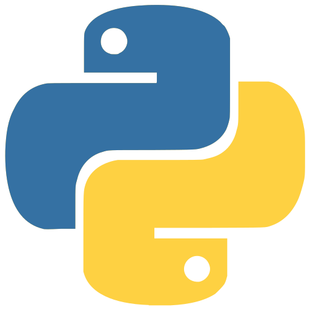
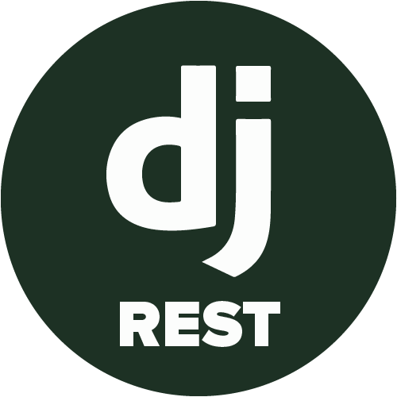
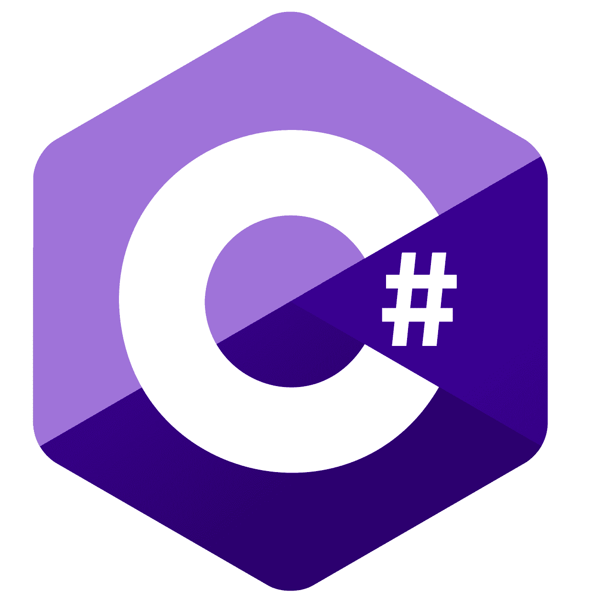
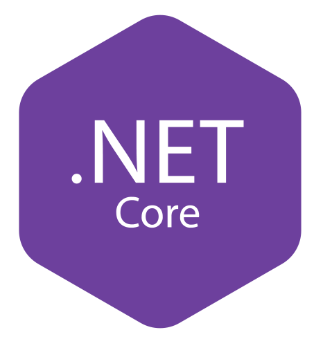

## 👋 Hey, I'm Giorgi

I'm a detail-oriented Full Stack Developer who enjoys building modern, scalable web applications and solving real-world problems through clean, efficient code. I care about writing maintainable Developer, improving user experience, and always learning something new.

I genuinely love solving problems, I am a problem solver and use technologies as tools to do that job. I am also an enthusiast who thinks that you can to build whatever you want here - only imagination is the limit.

##  &nbsp;About Me

<table>
  <tr>
    <td valign="top" width="60%">
      
- I’m Full Stack Developer
- All of my projects are available at **[My Portfolio](https://your-portfolio.com)**
- All of my projects are available at **[My Portfolio](https://web-portfolio-frsm.vercel.app)**
- Frontend: React, Next.js, Angular, TypeScript, Tailwind CSS
- Backend: Node.js, Nest.js, .Net
- State Management: Redux Toolkit, Zustand, Pinia,
- Forms & Validation: React Hook Form
- How to reach me **giorgi.kavtaradze2000@mail.ru**
    </td>
    <td valign="top" width="40%" align="center">
      
    </td>
  </tr>
</table>

## 🎓 About Me:
- I’m Full Stack Developer
- All of my projects are available at **[My Portfolio](https://your-portfolio.com)**
- All of my projects are available at **[My Portfolio](https://web-portfolio-frsm.vercel.app)**
- Frontend: React, Next.js, Angular, TypeScript, Tailwind CSS
- Backend: Node.js, Nest.js, .Net
- State Management: Redux Toolkit, Zustand, Pinia,
- Forms & Validation: React Hook Form
- How to reach me **giorgi.kavtaradze2000@mail.ru**

 
## 💻 Tech Stack:

  
  
  
  
  
  
  
  
  
  
  
  
  
  
  
  
  
  
  
  
  
  
  
  
  
  
  
  

