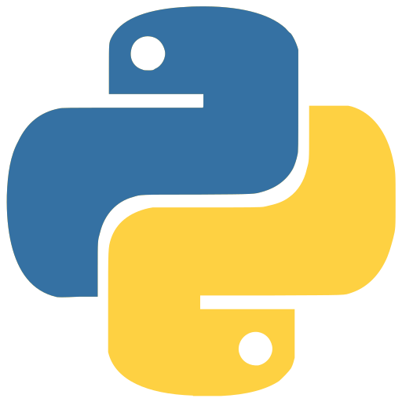
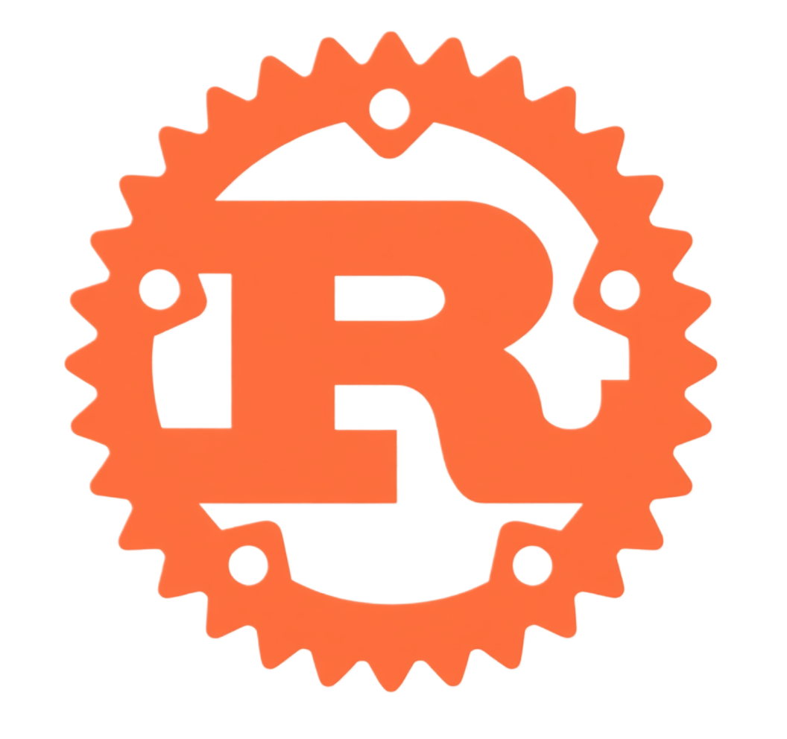
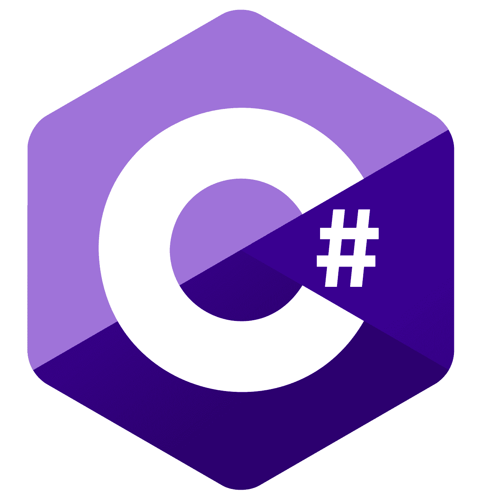
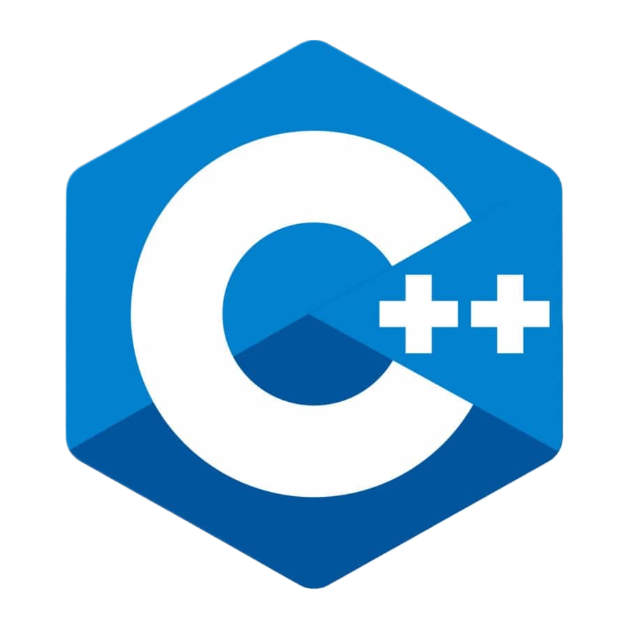
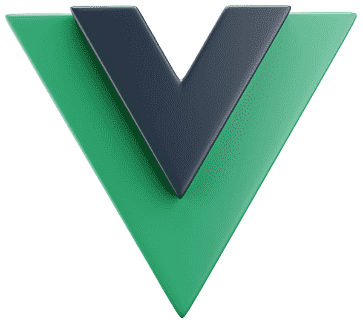
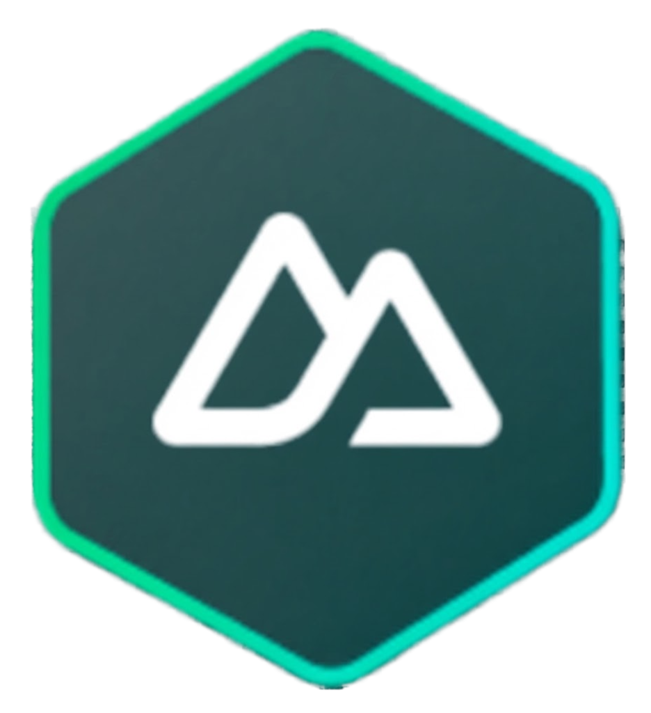
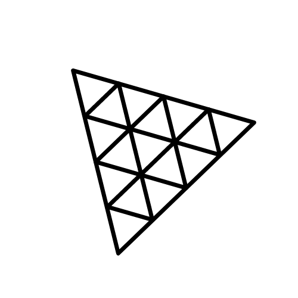
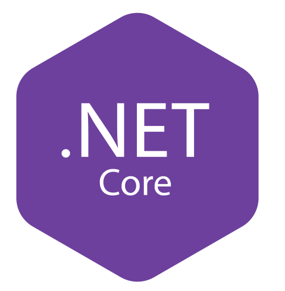
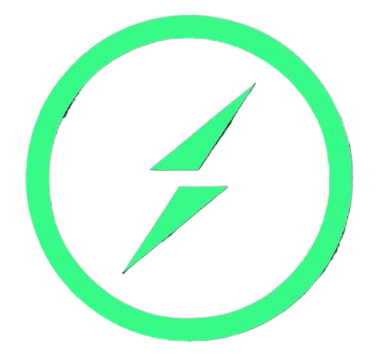
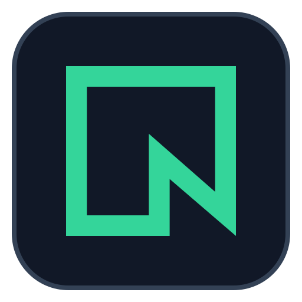

### 👋 Hey, I'm Giorgi Kavtaradze

###  I’m Full-Stack Developer
All of my projects are available at **[My Portfolio](https://your-portfolio.com)**
All of my projects are available at **[My Portfolio](https://web-portfolio-frsm.vercel.app)**

**Frameworks & Mobile**

**Frontend**

**Backend & API**

**Database & ORM**

**State Management**

**Forms & Validation**

### DevOps & Platform Engineering

**Cloud & Infrastructure as Code (IaC)**

**Containers & Edge Orchestration**

**GitOps & Continuous Delivery (CI/CD)**

**eBPF Observability, Security & FinOps**

**Contact** giorgi.kavtaradze2000@gmail.com

### Socials
<table>
  <tr>
    <td></td>
    <td></td>
    <td></td>
    <td></td>
  </tr>
</table>
 
### Tech Stack
<table width="100%">
  <tr>
    <td align="center" width="7.14%"></td>
    <td align="center" width="7.14%"></td>
    <td align="center" width="7.14%"></td>
    <td align="center" width="7.14%"></td>
    <td align="center" width="7.14%"></td>
    <td align="center" width="7.14%"></td>
    <td align="center" width="7.14%"></td>
    <td align="center" width="7.14%"></td>
    <td align="center" width="7.14%"></td>
    <td align="center" width="7.14%"></td>
    <td align="center" width="7.14%"></td>
    <td align="center" width="7.14%"></td>
    <td align="center" width="7.14%"></td>
    <td align="center" width="7.14%"></td>
  </tr>
  <tr>
    <td align="center" width="7.14%"></td>
    <td align="center" width="7.14%"></td>
    <td align="center" width="7.14%"></td>
    <td align="center" width="7.14%"></td>
    <td align="center" width="7.14%"></td>
    <td align="center" width="7.14%"></td>
    <td align="center" width="7.14%"></td>
    <td align="center" width="7.14%"></td>
    <td align="center" width="7.14%"></td>
    <td align="center" width="7.14%"></td>
    <td align="center" width="7.14%"></td>
    <td align="center" width="7.14%"></td>
    <td align="center" width="7.14%"></td>
    <td align="center" width="7.14%"></td>
  </tr>
  <tr>
    <td align="center" width="7.14%"></td>
    <td align="center" width="7.14%"></td>
    <td align="center" width="7.14%"></td>
    <td align="center" width="7.14%"></td>
    <td align="center" width="7.14%"></td>
    <td align="center" width="7.14%"></td>
    <td align="center" width="7.14%"></td>
    <td align="center" width="7.14%"></td>
    <td align="center" width="7.14%"></td>
    <td align="center" width="7.14%"></td>
    <td align="center" width="7.14%"></td>
    <td align="center" width="7.14%"></td>
    <td align="center" width="7.14%"></td>
    <td align="center" width="7.14%"></td>
  </tr>
</table>

